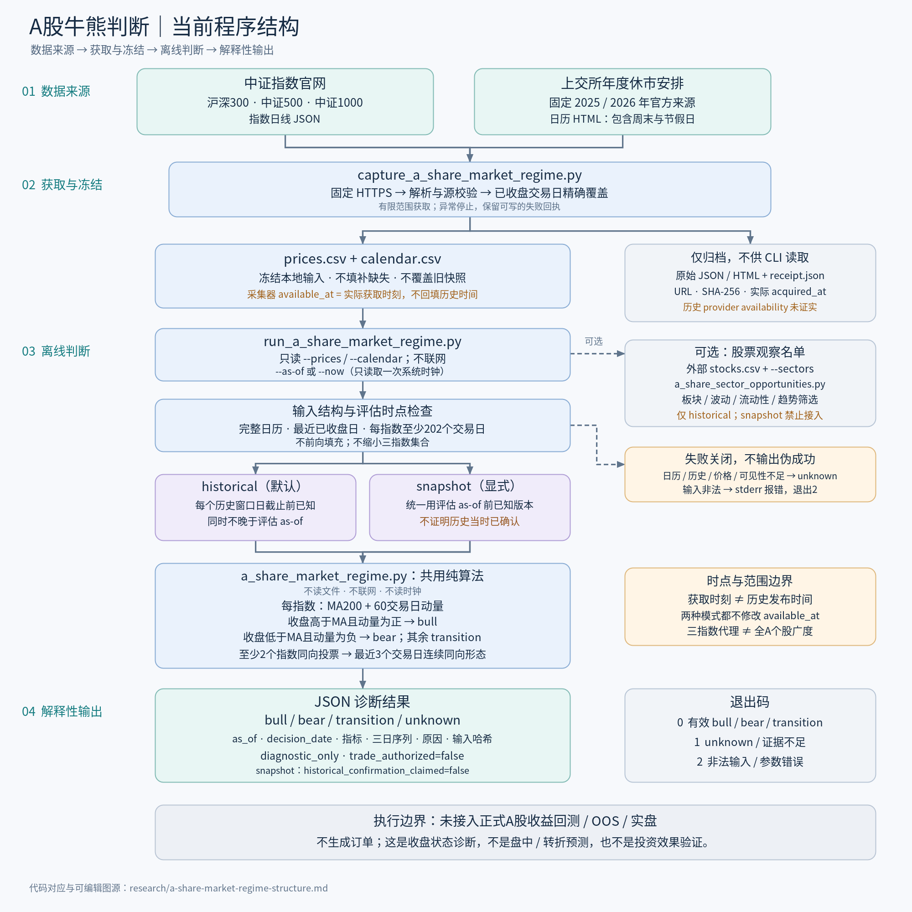
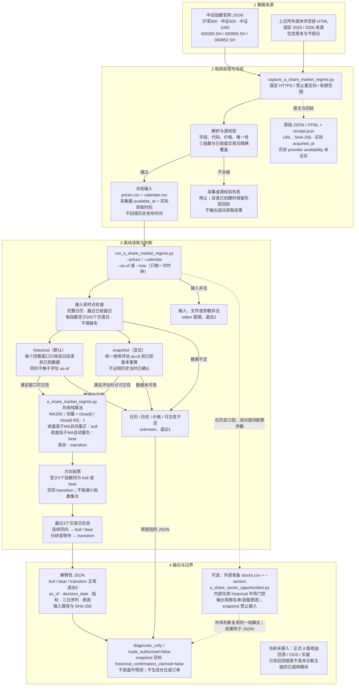

# A 股牛熊判断：当前程序结构

[打开 PNG](diagrams/a-share-market-regime-structure.png) · [可编辑 SVG](diagrams/a-share-market-regime-structure.svg) · [终端文本图](diagrams/a-share-market-regime-structure.tui.txt)

> 范围说明（2026-09-22）：图示只覆盖现有市场诊断 CLI 链路。另有[独立板块轮次纯函数](a-share-sector-rounds.md)，未接入该 CLI，不能把图中没有该模块理解为它不存在。文中的“本轮”指原制图阶段；本次仅核对并归档说明与既有图示，不重跑行情或收益研究。

这是一张现有程序的数据流图，不是未来架构或投资收益证明。连线表示数据处理关系，可选路径用虚线；归档是终点，评估 CLI 只读取 CSV。策略计算不联网；联网只发生在独立快照获取步骤。下方 Mermaid 为可编辑的逻辑图源。

## 代码对应关系

| 层 | 当前文件 / 关键入口 | 职责 |
| --- | --- | --- |
| 来源与冻结 | `experiments/capture_a_share_market_regime.py`：`capture_snapshot`、`parse_calendar`、`parse_index` | 官网请求、严格解析、原文/回执留存、CSV 输出；不授予历史可用时间权威 |
| 命令入口 | `experiments/run_a_share_market_regime.py`：`main` | CSV/参数读取、固定评估时点、选择口径、JSON 与退出码；不下载数据 |
| 纯判断 | `experiments/a_share_market_regime.py`：`evaluate_market_regime` | 日历/可用性检查、MA200、60日动量、三指数多数和三日形态；不读时钟/文件/网络 |
| 可选股票观察 | `experiments/a_share_sector_opportunities.py`：`evaluate_sector_opportunities` | 复用默认 historical 判断，按板块、波动率、流动性、趋势等条件筛选输入股票池；不是订单 |

## 两个容易混淆的边界

1. **完整价格不等于历史点时证据**：采集器用实际获取时刻作保守可见性边界。historical 不能把今天取得的数据倒推成过去已知；snapshot 只描述当前已知版本下的历史价格形态。
2. **诊断不等于回测/交易**：本链路不调用正式 A 股收益回测、OOS 或实盘执行，也不以旧探索性结果冒充验证。`--stocks/--sectors` 仅是可选观察名单路径，不能与 snapshot 合用。

`--now` 不刷新行情。盘中/休市日使用最近已收盘交易日；收盘后缺当天价格或日历过期时失败关闭。图中的截止时间判断均使用中国时区。

详细规则、真实快照结果与使用命令见 [A 股牛熊阶段识别](a-share-market-regime.md)。本轮仅制作结构图，未修改策略代码，未重跑策略测试、行情获取或收益回测。
